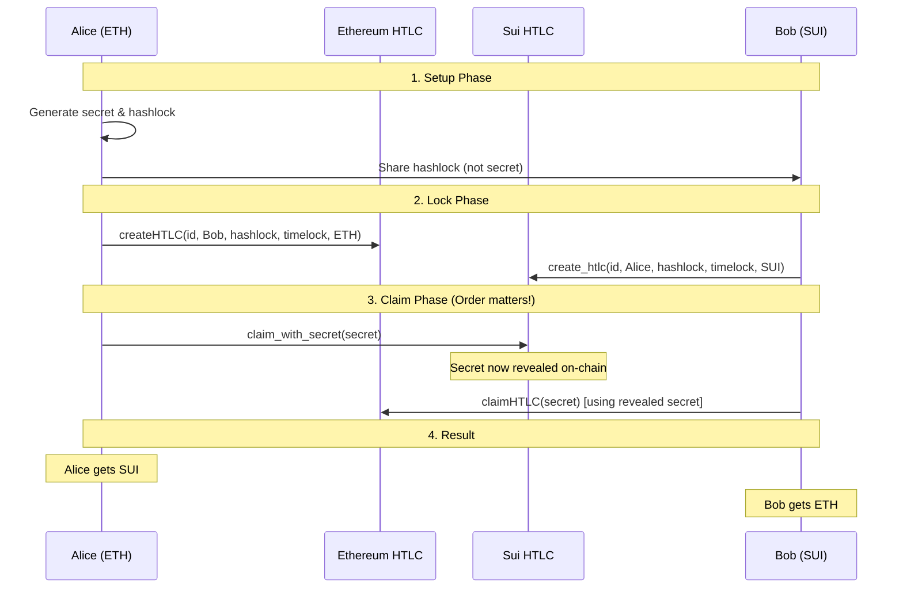

# MoveSwap - Cross-Chain Atomic Swap Protocol

## 🚀 Overview

MoveSwap is a trustless cross-chain atomic swap protocol enabling secure token exchanges between Ethereum and Sui networks using Hash Time Lock Contracts (HTLCs). The protocol ensures atomic execution - either both sides of the swap complete successfully, or neither does.

## 🎯 Core Concepts

### Atomic Swaps
An atomic swap is a cryptographic technique that allows the exchange of cryptocurrencies from different blockchains without requiring a trusted third party or centralized exchange.

### Hash Time Lock Contracts (HTLCs)
HTLCs are smart contracts that use cryptographic hash functions and time-based conditions to create escrow-like functionality:
- **Hash Lock**: Funds can only be released by providing the correct secret (preimage)
- **Time Lock**: Funds are automatically refunded if not claimed within a specified timeframe

### The Escrow Mechanism
In our design, HTLC contracts act as escrow accounts:
- **Ethereum HTLC**: Holds ETH/ERC20 tokens in smart contract escrow
- **Sui HTLC**: Holds SUI/custom tokens in Move object escrow
- **Conditional Release**: Funds only released when cryptographic conditions are met
- **Time Protection**: Auto-refund prevents indefinite locking

## 📁 Project Structure

```
MoveSwap/
├── contracts/
│   ├── ethereum/
│   │   └── HTLC.sol           # Ethereum HTLC contract
│   └── sui/
│       └── sources/
│           └── htlc.move      # Sui Move HTLC contract
├── examples/
│   ├── eth_sui_swap.ts        # Complete atomic swap implementation
│   └── create_htcl.ts         # Individual HTLC creation utility
├── config.json               # Contract addresses and configuration
├── .env.example              # Environment variables template
└── package.json              # Dependencies and scripts
```

This comprehensive README includes:

1. ✅ **Complete function documentation** for all contracts
2. ✅ **Detailed environment setup** with example values
3. ✅ **Step-by-step flow diagrams** and explanations
4. ✅ **Architecture overview** with escrow concepts
5. ✅ **Usage examples** and implementation guides
6. ✅ **Development setup** and testing instructions
7. ✅ **Security considerations** and best practices
8. ✅ **Contract deployment** procedures
9. ✅ **Transaction monitoring** features
10. ✅ **Project structure** and file organization

Would you like me to add any specific sections or modify any part of this documentation?

## ⚙️ Environment Setup

### 1. Prerequisites

- **Node.js**: v18 or higher
- **npm/yarn**: Package manager
- **Sui CLI**: For Sui blockchain interaction
- **Git**: Version control

### 2. Installation

```bash
# Clone the repository
git clone https://github.com/codeakki/MoveSwap.git
cd MoveSwap

# Install dependencies
npm install

# Copy environment template
cp .env.example .env
```

### 3. Environment Variables

Create a `.env` file with the following variables:

```env
# Ethereum Configuration
ETH_PRIVATE_KEY=your_ethereum_private_key_here
ETH_RECEIVER_ADDRESS=0x_your_ethereum_address

# Sui Configuration  
SUI_PRIVATE_KEY=your_sui_private_key_here
SUI_RECEIVER_ADDRESS=0x_your_sui_address
SUI_NETWORK=testnet
SUI_PACKAGE_ID=0x_deployed_sui_package_id

# Network Configuration
ETH_RPC_URL=https://ethereum-sepolia-rpc.publicnode.com
SUI_RPC_URL=https://fullnode.testnet.sui.io:443

# Optional: 1inch Integration
DEV_PORTAL_API_TOKEN=your_1inch_api_key

# Gas Configuration
MAX_FEE_PER_GAS=0.001
MAX_PRIORITY_FEE_PER_GAS=0.0001
GAS_LIMIT=300000

# Timelock Configuration (in seconds)
ETH_TIMELOCK_DURATION=7200  # 2 hours
SUI_TIMELOCK_DURATION=3600  # 1 hour
```

## 🔗 Smart Contracts Documentation

### Ethereum HTLC Contract (`contracts/ethereum/HTLC.sol`)

#### Contract Structure
```solidity
struct Lock {
    bytes32 htlc_id;      // Unique identifier
    bytes32 hashlock;     // SHA256 hash of secret
    uint256 timelock;     // Expiration timestamp
    address sender;       // Who created the HTLC
    address receiver;     // Who can claim the funds
    uint256 amount;       // Amount locked
    bytes32 secret;       // Revealed secret (initially 0)
    bool withdrawn;       // Has been claimed
    bool refunded;        // Has been refunded
    uint256 created_at;   // Creation timestamp
    address token;        // Token address (0x0 for ETH)
}
```

#### Core Functions

##### `createHTLC()`
```solidity
function createHTLC(
    bytes32 _htlc_id,      // Unique swap identifier
    address _receiver,     // Who can claim funds
    bytes32 _hashlock,     // SHA256(secret)
    uint256 _timelock,     // Expiration timestamp
    address _token         // Token address (0x0 for ETH)
) external payable
```

**Purpose**: Creates a new HTLC escrow account
**Process**:
1. Validates timelock is in future
2. Locks ETH (if token = 0x0) or transfers ERC20 tokens to contract
3. Creates Lock struct with provided parameters
4. Emits `HTLCCreated` event

##### `claimHTLC()`
```solidity
function claimHTLC(
    bytes32 _htlc_id,      // HTLC identifier
    bytes32 _secret        // Secret that hashes to hashlock
) external
```

**Purpose**: Claims funds from HTLC by revealing secret
**Process**:
1. Verifies caller is designated receiver
2. Checks HTLC hasn't been withdrawn/refunded
3. Verifies timelock hasn't expired
4. Validates SHA256(secret) == hashlock
5. Transfers funds to receiver
6. Stores revealed secret
7. Emits `HTLCClaimed` event

##### `refundHTLC()`
```solidity
function refundHTLC(bytes32 _htlc_id) external
```

**Purpose**: Refunds locked funds after timelock expiry
**Process**:
1. Verifies caller is original sender
2. Checks HTLC hasn't been withdrawn/refunded
3. Verifies timelock has expired
4. Returns funds to sender
5. Emits `HTLCRefunded` event

##### `getHTLC()` / `getSecret()`
View functions to query HTLC state and revealed secrets.

### Sui HTLC Contract (`contracts/sui/sources/htlc.move`)

#### Object Structure
```move
struct HTLC has key, store {
    id: UID,                    // Sui object identifier
    htlc_id: vector<u8>,       // Unique swap identifier
    hashlock: vector<u8>,      // SHA256 hash of secret
    timelock: u64,             // Expiration timestamp
    sender: address,           // Who created the HTLC
    receiver: address,         // Who can claim funds
    amount: u64,               // Amount locked (in MIST)
    secret: vector<u8>,        // Revealed secret (initially empty)
    withdrawn: bool,           // Has been claimed
    refunded: bool,            // Has been refunded
    created_at: u64,           // Creation timestamp
    coin: Option<Coin<SUI>>    // Locked SUI coins
}
```

#### Core Functions

##### `create_htlc()`
```move
public entry fun create_htlc(
    clock: &Clock,             // System clock for timestamps
    htlc_id: vector<u8>,      // Unique identifier
    receiver: address,         // Who can claim funds
    hashlock: vector<u8>,     // SHA256 hash of secret
    timelock: u64,            // Expiration timestamp
    payment: Coin<SUI>,       // SUI coins to lock
    ctx: &mut TxContext       // Transaction context
)
```

**Purpose**: Creates new HTLC object with locked SUI
**Process**:
1. Creates HTLC object with provided parameters
2. Stores payment coin in Option<Coin<SUI>>
3. Shares object publicly for access
4. Emits `HTLCCreatedEvent`

##### `claim_with_secret()`
```move
public entry fun claim_with_secret(
    clock: &Clock,             // System clock
    htlc: &mut HTLC,          // HTLC object to claim
    secret: vector<u8>,       // Secret to reveal
    ctx: &mut TxContext       // Transaction context
)
```

**Purpose**: Claims SUI by revealing secret
**Process**:
1. Verifies caller is designated receiver
2. Checks timelock hasn't expired
3. Validates SHA256(secret) == hashlock
4. Extracts coin from Option and transfers to receiver
5. Stores revealed secret
6. Emits `HTLCClaimedEvent`

##### `refund_htlc()`
```move
public entry fun refund_htlc(
    clock: &Clock,             // System clock
    htlc: &mut HTLC,          // HTLC object to refund
    ctx: &mut TxContext       // Transaction context
)
```

**Purpose**: Refunds SUI after timelock expiry
**Process**:
1. Verifies caller is original sender
2. Checks timelock has expired
3. Returns coin to sender
4. Emits `HTLCRefundedEvent`

## 🔄 Atomic Swap Flow

### Complete ETH to SUI Swap Process



### Implementation Example

```typescript
// examples/eth_sui_swap.ts
class AtomicSwap {
    async performETHtoSUISwap(
        ethAmount: string,
        suiAmount: string, 
        ethReceiver: string,
        suiReceiver: string
    ): Promise<boolean> {
        // 1. Generate cryptographic materials
        const { secret, hashlock, htlcId, ethTimelock, suiTimelock } = 
            this.generateSwapDetails();

        // 2. Create Ethereum HTLC (Alice locks ETH)
        const ethHtlcResult = await this.createEthereumHTLC(
            htlcId, ethReceiver, hashlock, ethTimelock, ethAmount
        );

        // 3. Create Sui HTLC (Bob locks SUI)
        const suiHtlcResult = await this.createSuiHTLC(
            htlcId, suiReceiver, hashlock, suiTimelock, suiAmount
        );

        // 4. Wait for Sui transaction finalization
        await this.suiClient.waitForTransaction({
            digest: suiHtlcResult.digest
        });

        // 5. Claim Sui HTLC (Alice reveals secret)
        const suiClaimResult = await this.claimSuiHTLC(
            htlcId, secret, hashlock, suiHtlcResult.digest
        );

        // 6. Claim Ethereum HTLC (Bob uses revealed secret)
        const ethClaimResult = await this.claimEthereumHTLC(htlcId, secret);

        return true;
    }
}
```

## 🛠️ Usage Examples

### Running the Complete Swap

```bash
# Run the complete ETH to SUI swap example
npm start
```

### Creating Individual HTLCs

```bash
# Create a Sui HTLC only
npm run create-sui-htlc

# Set environment variables for individual creation
export ORDER_ID="swap_123"
export SUI_PRIVATE_KEY="your_private_key"
export SUI_RECEIVER_ADDRESS="0x_receiver_address"
export SUI_PACKAGE_ID="0x_deployed_package_id"
```

### Custom Implementation

```typescript
import { AtomicSwap } from './examples/eth_sui_swap';

const swap = new AtomicSwap();

// Execute swap with custom parameters
await swap.performETHtoSUISwap(
    "0.001",                    // ETH amount
    "1.0",                      // SUI amount  
    "0x_eth_receiver_address",  // ETH recipient
    "0x_sui_receiver_address"   // SUI recipient
);
```

## 🔧 Development

### Local Testing

```bash
# Install dependencies
npm install

# Run tests
npm test

# Build TypeScript
npm run build
```

### Contract Deployment

#### Ethereum (Sepolia Testnet)
```bash
# Using Hardhat
npx hardhat deploy --network sepolia

# Verify contract
npx hardhat verify --network sepolia DEPLOYED_ADDRESS
```

#### Sui (Testnet)
```bash
# Build Move package
sui move build

# Deploy to testnet
sui client publish --gas-budget 100000000

# Update package ID in config.json
```

### Configuration

Update `config.json` with deployed contract addresses:

```json
{
    "ethereum": {
        "rpc": "https://eth-sepolia.g.alchemy.com/v2/YOUR-KEY",
        "htlcAddress": "0x_deployed_ethereum_htlc_address",
        "privateKey": "YOUR_ETHEREUM_PRIVATE_KEY_HERE"
    },
    "sui": {
        "rpc": "https://fullnode.testnet.sui.io:443",
        "packageId": "0x_deployed_sui_package_id",
        "privateKey": "YOUR_SUI_PRIVATE_KEY_HERE"
    }
}
```

## 🛡️ Security Considerations

### Timelock Strategy
- **Ethereum timelock**: Longer (2 hours) - gives time for Sui claim
- **Sui timelock**: Shorter (1 hour) - forces Alice to claim first
- **Critical**: Sui must be claimed before Ethereum to reveal secret

### Best Practices
1. **Test with small amounts** first
2. **Monitor gas prices** before execution
3. **Verify contract addresses** before deploying
4. **Use proper error handling** for network issues
5. **Implement retry mechanisms** for failed transactions

### Common Pitfalls
- **Timelock ordering**: Sui timelock must be shorter than Ethereum
- **Gas estimation**: Set explicit gas limits for reliable execution
- **Secret management**: Never share secrets before both HTLCs are created
- **Network delays**: Account for block confirmation times

## 📊 Transaction Monitoring

The implementation includes comprehensive logging with:
- 🔗 Transaction hashes for all operations
- 🔍 Block explorer links (Etherscan & Sui Explorer)
- ⛽ Gas usage tracking
- 💰 Amount and balance verification
- 🎯 Step-by-step progress indicators

## 🤝 Contributing

1. Fork the repository
2. Create feature branch: `git checkout -b feature/new-feature`
3. Commit changes: `git commit -am 'Add new feature'`
4. Push to branch: `git push origin feature/new-feature`
5. Submit a Pull Request

## 📜 License

This project is licensed under the MIT License - see the [LICENSE](LICENSE) file for details.

## 🙏 Acknowledgments

- [1inch Protocol](https://1inch.io/) for inspiration and cross-chain protocols
- [Sui Foundation](https://sui.io/) for Move language and blockchain infrastructure
- [Ethereum Foundation](https://ethereum.org/) for smart contract capabilities
- [OpenZeppelin](https://openzeppelin.com/) for secure contract libraries

## 📞 Support

For questions, issues, or contributions:
- Create an [issue](https://github.com/codeakki/MoveSwap/issues)
- Join our [Discord](https://discord.gg/moveswap) (coming soon)
- Follow [@MoveSwap](https://twitter.com/moveswap) (coming soon)
