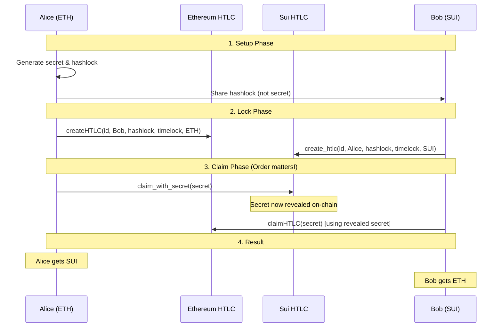

# MoveSwap - Cross-Chain Atomic Swap Protocol

## 🚀 Overview

MoveSwap is a comprehensive cross-chain atomic swap protocol enabling secure token exchanges between Base (Ethereum L2) and Sui networks. The protocol combines Hash Time Lock Contracts (HTLCs) with 1inch Limit Order Protocol integration for efficient, trustless cross-chain swaps. The project includes both CLI tools and a modern React frontend for seamless user experience.

## 🎯 Core Concepts

### Atomic Swaps
An atomic swap is a cryptographic technique that allows the exchange of cryptocurrencies from different blockchains without requiring a trusted third party or centralized exchange.

### Hash Time Lock Contracts (HTLCs)
HTLCs are smart contracts that use cryptographic hash functions and time-based conditions to create escrow-like functionality:
- **Hash Lock**: Funds can only be released by providing the correct secret (preimage)
- **Time Lock**: Funds are automatically refunded if not claimed within a specified timeframe

### The Escrow Mechanism
In our design, HTLC contracts act as escrow accounts:
- **Ethereum HTLC**: Holds ETH/ERC20 tokens in smart contract escrow
- **Sui HTLC**: Holds SUI/custom tokens in Move object escrow
- **Conditional Release**: Funds only released when cryptographic conditions are met
- **Time Protection**: Auto-refund prevents indefinite locking

## 📁 Project Structure

```
MoveSwap/
├── contracts/
│   ├── ethereum/
│   │   └── HTLC.sol           # Ethereum HTLC contract
│   └── sui/
│       ├── sources/
│       │   └── htlc.move      # Sui Move HTLC contract
│       ├── Move.toml          # Sui package configuration
│       └── build/             # Compiled Move bytecode
├── frontend/                  # React frontend application
│   ├── src/
│   │   ├── App.jsx           # Main application component
│   │   ├── components/       # UI components
│   │   └── assets/           # Static assets
│   ├── package.json          # Frontend dependencies
│   └── vite.config.js        # Vite configuration
├── test/
│   ├── atomic_swap_cli.ts    # Interactive CLI for atomic swaps
│   └── test_cli.js           # CLI test suite
├── examples/
│   └── eth_sui_swap.ts       # Complete atomic swap implementation
├── scripts/
│   └── deploy.ts             # Contract deployment scripts
├── config.json               # Multi-network configuration
├── package.json              # Main project dependencies
├── hardhat.config.js         # Hardhat configuration
└── README.md                 # This documentation
```

## 🎯 Key Features

- **Cross-Chain Atomic Swaps**: Secure token exchanges between Base and Sui
- **1inch Integration**: Efficient DEX integration for Base chain swaps
- **HTLC Security**: Hash Time Lock Contracts ensure atomic execution
- **Interactive CLI**: Step-by-step swap execution with progress tracking
- **Modern Frontend**: React-based UI for user-friendly swap interface
- **Multi-Network Support**: Mainnet and testnet configurations
- **Comprehensive Testing**: CLI test suite and validation tools

## ⚙️ Environment Setup

### 1. Prerequisites

- **Node.js**: v18 or higher
- **npm/yarn**: Package manager
- **Sui CLI**: For Sui blockchain interaction
- **Git**: Version control
- **pnpm**: For frontend dependencies (optional)

### 2. Installation

```bash
# Clone the repository
git clone https://github.com/codeakki/MoveSwap.git
cd MoveSwap

# Install main dependencies
npm install

# Install frontend dependencies (optional)
cd frontend
npm install
cd ..

# Copy environment template
cp env.example .env
```

### 3. Environment Variables

Create a `.env` file with the following variables:

```env
# Base Configuration
BASE_PRIVATE_KEY=your_base_private_key_here
BASE_RPC_URL=https://base-mainnet.g.alchemy.com/v2/YOUR_KEY

# Sui Configuration  
SUI_PRIVATE_KEY=your_sui_private_key_here
SUI_RPC_URL=https://sui-mainnet-rpc.allthatnode.com

# Network Selection
NETWORK=mainnet  # or base-sepolia for testnet

# Optional: 1inch Integration
DEV_PORTAL_API_TOKEN=your_1inch_api_key

# Gas Configuration
MAX_FEE_PER_GAS=0.001
MAX_PRIORITY_FEE_PER_GAS=0.0001
GAS_LIMIT=300000

# Timelock Configuration (in seconds)
BASE_TIMELOCK_DURATION=7200  # 2 hours
SUI_TIMELOCK_DURATION=3600   # 1 hour
```

## 🔗 Smart Contracts Documentation

### Ethereum HTLC Contract (`contracts/ethereum/HTLC.sol`)

#### Contract Structure
```solidity
struct Lock {
    bytes32 htlc_id;      // Unique identifier
    bytes32 hashlock;     // SHA256 hash of secret
    uint256 timelock;     // Expiration timestamp
    address sender;       // Who created the HTLC
    address receiver;     // Who can claim the funds
    uint256 amount;       // Amount locked
    bytes32 secret;       // Revealed secret (initially 0)
    bool withdrawn;       // Has been claimed
    bool refunded;        // Has been refunded
    uint256 created_at;   // Creation timestamp
    address token;        // Token address (0x0 for ETH)
}
```

#### Core Functions

##### `createHTLC()`
```solidity
function createHTLC(
    bytes32 _htlc_id,      // Unique swap identifier
    address _receiver,     // Who can claim funds
    bytes32 _hashlock,     // SHA256(secret)
    uint256 _timelock,     // Expiration timestamp
    address _token         // Token address (0x0 for ETH)
) external payable
```

**Purpose**: Creates a new HTLC escrow account
**Process**:
1. Validates timelock is in future
2. Locks ETH (if token = 0x0) or transfers ERC20 tokens to contract
3. Creates Lock struct with provided parameters
4. Emits `HTLCCreated` event

##### `claimHTLC()`
```solidity
function claimHTLC(
    bytes32 _htlc_id,      // HTLC identifier
    bytes32 _secret        // Secret that hashes to hashlock
) external
```

**Purpose**: Claims funds from HTLC by revealing secret
**Process**:
1. Verifies caller is designated receiver
2. Checks HTLC hasn't been withdrawn/refunded
3. Verifies timelock hasn't expired
4. Validates SHA256(secret) == hashlock
5. Transfers funds to receiver
6. Stores revealed secret
7. Emits `HTLCClaimed` event

##### `refundHTLC()`
```solidity
function refundHTLC(bytes32 _htlc_id) external
```

**Purpose**: Refunds locked funds after timelock expiry
**Process**:
1. Verifies caller is original sender
2. Checks HTLC hasn't been withdrawn/refunded
3. Verifies timelock has expired
4. Returns funds to sender
5. Emits `HTLCRefunded` event

##### `getHTLC()` / `getSecret()`
View functions to query HTLC state and revealed secrets.

### Sui HTLC Contract (`contracts/sui/sources/htlc.move`)

#### Object Structure
```move
struct HTLC has key, store {
    id: UID,                    // Sui object identifier
    htlc_id: vector<u8>,       // Unique swap identifier
    hashlock: vector<u8>,      // SHA256 hash of secret
    timelock: u64,             // Expiration timestamp
    sender: address,           // Who created the HTLC
    receiver: address,         // Who can claim funds
    amount: u64,               // Amount locked (in MIST)
    secret: vector<u8>,        // Revealed secret (initially empty)
    withdrawn: bool,           // Has been claimed
    refunded: bool,            // Has been refunded
    created_at: u64,           // Creation timestamp
    coin: Option<Coin<SUI>>    // Locked SUI coins
}
```

#### Core Functions

##### `create_htlc()`
```move
public entry fun create_htlc(
    clock: &Clock,             // System clock for timestamps
    htlc_id: vector<u8>,      // Unique identifier
    receiver: address,         // Who can claim funds
    hashlock: vector<u8>,     // SHA256 hash of secret
    timelock: u64,            // Expiration timestamp
    payment: Coin<SUI>,       // SUI coins to lock
    ctx: &mut TxContext       // Transaction context
)
```

**Purpose**: Creates new HTLC object with locked SUI
**Process**:
1. Creates HTLC object with provided parameters
2. Stores payment coin in Option<Coin<SUI>>
3. Shares object publicly for access
4. Emits `HTLCCreatedEvent`

##### `claim_with_secret()`
```move
public entry fun claim_with_secret(
    clock: &Clock,             // System clock
    htlc: &mut HTLC,          // HTLC object to claim
    secret: vector<u8>,       // Secret to reveal
    ctx: &mut TxContext       // Transaction context
)
```

**Purpose**: Claims SUI by revealing secret
**Process**:
1. Verifies caller is designated receiver
2. Checks timelock hasn't expired
3. Validates SHA256(secret) == hashlock
4. Extracts coin from Option and transfers to receiver
5. Stores revealed secret
6. Emits `HTLCClaimedEvent`

##### `refund_htlc()`
```move
public entry fun refund_htlc(
    clock: &Clock,             // System clock
    htlc: &mut HTLC,          // HTLC object to refund
    ctx: &mut TxContext       // Transaction context
)
```

**Purpose**: Refunds SUI after timelock expiry
**Process**:
1. Verifies caller is original sender
2. Checks timelock has expired
3. Returns coin to sender
4. Emits `HTLCRefundedEvent`

## 🔄 Atomic Swap Flow

### Complete ETH to SUI Swap Process



### Implementation Example

```typescript
// examples/eth_sui_swap.ts
class AtomicSwap {
    async performETHtoSUISwap(
        ethAmount: string,
        suiAmount: string, 
        ethReceiver: string,
        suiReceiver: string
    ): Promise<boolean> {
        // 1. Generate cryptographic materials
        const { secret, hashlock, htlcId, ethTimelock, suiTimelock } = 
            this.generateSwapDetails();

        // 2. Create Ethereum HTLC (Alice locks ETH)
        const ethHtlcResult = await this.createEthereumHTLC(
            htlcId, ethReceiver, hashlock, ethTimelock, ethAmount
        );

        // 3. Create Sui HTLC (Bob locks SUI)
        const suiHtlcResult = await this.createSuiHTLC(
            htlcId, suiReceiver, hashlock, suiTimelock, suiAmount
        );

        // 4. Wait for Sui transaction finalization
        await this.suiClient.waitForTransaction({
            digest: suiHtlcResult.digest
        });

        // 5. Claim Sui HTLC (Alice reveals secret)
        const suiClaimResult = await this.claimSuiHTLC(
            htlcId, secret, hashlock, suiHtlcResult.digest
        );

        // 6. Claim Ethereum HTLC (Bob uses revealed secret)
        const ethClaimResult = await this.claimEthereumHTLC(htlcId, secret);

        return true;
    }
}
```

## 🛠️ Usage Examples

### 1. Interactive CLI

The project includes a comprehensive CLI for step-by-step atomic swap execution:

```bash
# Start the interactive CLI
npx ts-node test/atomic_swap_cli.ts

# Initialize a Base to SUI swap
init-swap base ETH USDC 0.001 0x_sender_address 0x_receiver_address

# Create Base limit order
create-base-order

# Create Sui HTLC
create-sui-htlc

# Wait for Sui finalization
wait-for-sui-finalization

# Claim Sui HTLC (reveals secret)
claim-sui-htlc

# Execute Base order
execute-base-order
```

### 2. Frontend Application

Launch the React frontend for a user-friendly interface:

```bash
# Start the frontend development server
cd frontend
npm run dev

# Build for production
npm run build
```

### 3. Programmatic Usage

```typescript
import { AtomicSwap } from './examples/eth_sui_swap';

const swap = new AtomicSwap();

// Execute swap with custom parameters
await swap.performETHtoSUISwap(
    "0.001",                    // ETH amount
    "1.0",                      // SUI amount  
    "0x_eth_receiver_address",  // ETH recipient
    "0x_sui_receiver_address"   // SUI recipient
);
```

### 4. Testing

```bash
# Run CLI tests
node test/test_cli.js

# Run Hardhat tests
npm run test:hardhat

# Run all tests
npm test
```

## 🔧 Development

### Local Testing

```bash
# Install dependencies
npm install

# Run tests
npm test

# Build TypeScript
npm run build
```

### Contract Deployment

#### Ethereum (Sepolia Testnet)
```bash
# Using Hardhat
npx hardhat deploy --network sepolia

# Verify contract
npx hardhat verify --network sepolia DEPLOYED_ADDRESS
```

#### Sui (Testnet)
```bash
# Build Move package
sui move build

# Deploy to testnet
sui client publish --gas-budget 100000000

# Update package ID in config.json
```

### Configuration

The project uses a comprehensive `config.json` for multi-network support:

```json
{
    "base": {
        "rpc": "https://base-mainnet.g.alchemy.com/v2/YOUR_KEY",
        "htlcContract": "0x_deployed_htlc_address",
        "limitOrderProtocol": "0x111111125421ca6dc452d289314280a0f8842a65",
        "weth": "0x4200000000000000000000000000000000000006",
        "usdc": "0x833589fCD6eDb6E08f4c7C32D4f71b54bdA02913",
        "privateKey": "YOUR_BASE_PRIVATE_KEY",
        "chainId": 8453
    },
    "sui": {
        "packageId": "0x_deployed_sui_package_id",
        "privateKey": "YOUR_SUI_PRIVATE_KEY"
    },
    "tokens": {
        "ETH": "0x0000000000000000000000000000000000000000",
        "WETH": "0x4200000000000000000000000000000000000006",
        "USDC": "0x833589fCD6eDb6E08f4c7C32D4f71b54bdA02913"
    },
    "networks": {
        "mainnet": { /* mainnet configuration */ },
        "base-sepolia": { /* testnet configuration */ }
    }
}
```

## 🎨 Frontend Application

The project includes a modern React frontend built with Vite and Tailwind CSS:

### Features
- **Interactive Swap Interface**: User-friendly token swap interface
- **Real-time Progress Tracking**: Visual progress indicators for swap steps
- **Multi-Chain Support**: Support for Base and Sui networks
- **Responsive Design**: Mobile-friendly interface
- **Modern UI Components**: Built with Radix UI and Tailwind CSS

### Frontend Structure
```
frontend/
├── src/
│   ├── App.jsx              # Main application component
│   ├── components/          # Reusable UI components
│   │   └── ui/             # Base UI components (Button, Card, etc.)
│   ├── hooks/              # Custom React hooks
│   ├── lib/                # Utility functions
│   └── assets/             # Static assets
├── package.json            # Frontend dependencies
└── vite.config.js          # Vite configuration
```

### Development Commands
```bash
# Start development server
cd frontend
npm run dev

# Build for production
npm run build

# Preview production build
npm run preview
```

## 🛡️ Security Considerations

### Timelock Strategy
- **Base timelock**: Longer (2 hours) - gives time for Sui claim
- **Sui timelock**: Shorter (1 hour) - forces Alice to claim first
- **Critical**: Sui must be claimed before Base to reveal secret

### Best Practices
1. **Test with small amounts** first
2. **Monitor gas prices** before execution
3. **Verify contract addresses** before deploying
4. **Use proper error handling** for network issues
5. **Implement retry mechanisms** for failed transactions

### Common Pitfalls
- **Timelock ordering**: Sui timelock must be shorter than Base
- **Gas estimation**: Set explicit gas limits for reliable execution
- **Secret management**: Never share secrets before both HTLCs are created
- **Network delays**: Account for block confirmation times
- **1inch Integration**: Ensure proper order validation and gas estimation

## 📊 Transaction Monitoring

The implementation includes comprehensive logging with:
- 🔗 Transaction hashes for all operations
- 🔍 Block explorer links (BaseScan & Sui Explorer)
- ⛽ Gas usage tracking
- 💰 Amount and balance verification
- 🎯 Step-by-step progress indicators
- 🔄 CLI progress tracking with detailed logs
## 🤝 Contributing

1. Fork the repository
2. Create feature branch: `git checkout -b feature/new-feature`
3. Commit changes: `git commit -am 'Add new feature'`
4. Push to branch: `git push origin feature/new-feature`
5. Submit a Pull Request

## 📜 License

This project is licensed under the MIT License - see the [LICENSE](LICENSE) file for details.

## 🙏 Acknowledgments

- [1inch Protocol](https://1inch.io/) for Limit Order Protocol and DEX integration
- [Sui Foundation](https://sui.io/) for Move language and blockchain infrastructure
- [Base](https://base.org/) for Ethereum L2 infrastructure
- [OpenZeppelin](https://openzeppelin.com/) for secure contract libraries
- [Radix UI](https://www.radix-ui.com/) for accessible UI components


