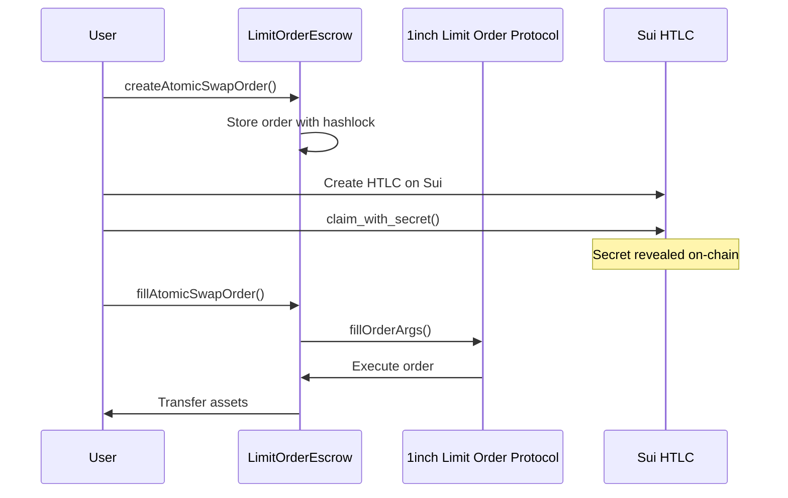

# Limit Order Protocol Integration

## 🎯 Overview

This document describes the integration of 1inch Limit Order Protocol's `fillOrderArgs` functionality into our atomic swap system. The integration enables more sophisticated order management and execution through the 1inch ecosystem.

## 🔗 Key Components

### 1. LimitOrderEscrow Contract

**Location**: `contracts/ethereum/LimitOrderEscrow.sol`

**Purpose**: Main escrow contract that integrates with 1inch Limit Order Protocol

**Key Features**:
- Uses `fillOrderArgs` for order execution
- Maintains atomic swap functionality with hashlock/timelock
- Supports both ETH and ERC20 tokens
- Implements relayer authorization system

### 2. Deployment Script

**Location**: `scripts/deploy-limit-order-escrow.ts`

**Purpose**: Automated deployment of the escrow contract

**Usage**:
```bash
npm run deploy:escrow
```

### 3. Atomic Swap Implementation

**Location**: `examples/limit-order-atomic-swap.ts`

**Purpose**: Complete atomic swap implementation using Limit Order Protocol

**Usage**:
```bash
npm run start:limit-order
```

## 🏗️ Architecture

### Contract Integration Flow



### Key Functions

#### `createAtomicSwapOrder()`
- Creates an atomic swap order using 1inch order data
- Stores order with hashlock and timelock
- Supports both ETH and ERC20 deposits
- Emits `AtomicSwapOrderCreated` event

#### `fillAtomicSwapOrder()`
- Executes the order using 1inch's `fillOrderArgs`
- Validates secret against hashlock
- Transfers assets to counterparty
- Emits `AtomicSwapOrderFilled` event

#### `refundAtomicSwapOrder()`
- Refunds assets after timelock expiry
- Only callable by order parties
- Emits `AtomicSwapOrderRefunded` event

## 🔧 Configuration

### Environment Variables

```bash
# Ethereum Configuration
ETHEREUM_RPC=https://eth-sepolia.g.alchemy.com/v2/YOUR-ALCHEMY-KEY
ETH_PRIVATE_KEY=your_ethereum_private_key
ETH_RECEIVER_ADDRESS=0x_receiver_address

# Sui Configuration  
SUI_PRIVATE_KEY=your_sui_private_key
SUI_PACKAGE_ID=0x_deployed_package_id

# Network Selection
NETWORK=sepolia  # or mainnet
```

### Contract Addresses

**Sepolia Testnet**:
- Limit Order Protocol: `0x1111111254EEB25477B68fb85Ed929f73A960582`
- WETH: `0xfFf9976782d46CC05630D1f6eBAb18b2324d6B14`

**Mainnet**:
- Limit Order Protocol: `0x1111111254EEB25477B68fb85Ed929f73A960582`
- WETH: `0xC02aaA39b223FE8D0A0e5C4F27eAD9083C756Cc2`

## 🚀 Deployment Process

### 1. Deploy the Escrow Contract

```bash
# Set environment variables
export ETHEREUM_RPC="https://eth-sepolia.g.alchemy.com/v2/YOUR-ALCHEMY-KEY"
export ETH_PRIVATE_KEY="your_private_key"
export NETWORK="sepolia"

# Deploy contract
npm run deploy:escrow
```

### 2. Update Configuration

After deployment, update `config.json` with the new contract address:

```json
{
  "ethereum": {
    "limitOrderEscrowAddress": "0x_DEPLOYED_CONTRACT_ADDRESS",
    "limitOrderProtocol": "0x1111111254EEB25477B68fb85Ed929f73A960582",
    "weth": "0xfFf9976782d46CC05630D1f6eBAb18b2324d6B14"
  }
}
```

### 3. Authorize Relayers

```typescript
// Authorize a relayer address
await escrowContract.authorizeRelayer(relayerAddress);
```

## 🧪 Testing

### Run Limit Order Atomic Swap

```bash
# Test the complete swap flow
npm run start:limit-order
```

### Expected Output

```
🚀 Starting Limit Order Atomic Swap...
=====================================
💰 ETH Amount: 0.001
💰 SUI Amount: 0.001
👤 ETH Receiver: 0x...
👤 SUI Receiver: 0x...
=====================================

🎲 Generated swap order:
📝 Order ID: abc123...
🔐 Hashlock: 0x...
🔐 Secret: 0x...
⏰ ETH Timelock: 2024-01-01T12:00:00.000Z
⏰ SUI Timelock: 2024-01-01T11:00:00.000Z

📋 Step 1: Creating Ethereum Atomic Swap Order...
🔗 Creating Ethereum Atomic Swap Order...
✅ Ethereum Atomic Swap Order created successfully!

📋 Step 2: Creating Sui HTLC...
🔗 Creating Sui HTLC...
✅ Sui HTLC created successfully!

📋 Step 3: Claiming Sui HTLC (revealing secret)...
🔓 Claiming Sui HTLC...
✅ Sui HTLC claimed successfully!

📋 Step 4: Filling Ethereum Atomic Swap Order...
🔓 Filling Atomic Swap Order...
✅ Atomic Swap Order filled successfully!

🎉 LIMIT ORDER ATOMIC SWAP COMPLETED SUCCESSFULLY! 🎉
```

## 🔍 Monitoring

### Transaction Tracking

All transactions include explorer links for monitoring:

- **Ethereum**: https://sepolia.etherscan.io/tx/{txHash}
- **Sui**: https://suiexplorer.com/txblock/{digest}?network=testnet

### Events

Monitor these events for order lifecycle:

- `AtomicSwapOrderCreated`: Order created
- `AtomicSwapOrderFilled`: Order executed
- `AtomicSwapOrderRefunded`: Order refunded

## 🛡️ Security Considerations

### Access Control
- Only authorized relayers can execute `fillAtomicSwapOrder`
- Order parties can refund after timelock expiry
- Owner can authorize/revoke relayers

### Validation
- Hashlock validation using SHA256
- Timelock enforcement
- Reentrancy protection
- Input validation for all parameters

### Emergency Functions
- `emergencyRecover()`: Owner can recover stuck tokens
- `revokeRelayer()`: Remove malicious relayers

## 🔄 Integration with Existing System

The Limit Order Protocol integration maintains compatibility with:

- ✅ Existing Sui HTLC contracts
- ✅ Hashlock/timelock functionality  
- ✅ Bidirectional swap capability
- ✅ Frontend integration

## 📚 References

- [1inch Limit Order Protocol Documentation](https://portal.1inch.dev/documentation/contracts/limit-order-protocol/limit-order-introduction)
- [1inch SDK](https://github.com/1inch/1inch-sdk)
- [OpenZeppelin Contracts](https://docs.openzeppelin.com/contracts/)

## 🐛 Troubleshooting

### Common Issues

1. **"Not authorized relayer"**
   - Solution: Authorize the relayer using `authorizeRelayer()`

2. **"Order not found"**
   - Solution: Verify order ID and contract address

3. **"Invalid secret"**
   - Solution: Ensure secret matches the hashlock

4. **"Order expired"**
   - Solution: Check timelock and create new order if needed

### Debug Commands

```bash
# Check contract deployment
npm run deploy:escrow

# Test with verbose logging
DEBUG=true npm run start:limit-order

# Verify configuration
node -e "console.log(require('./config.json'))"
```
